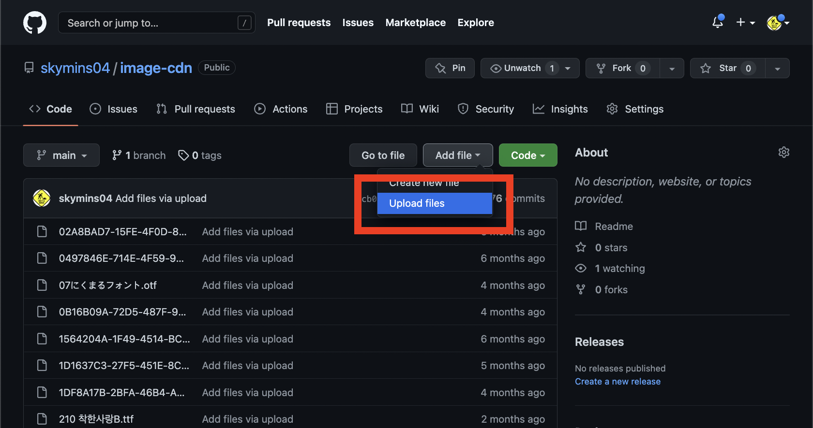
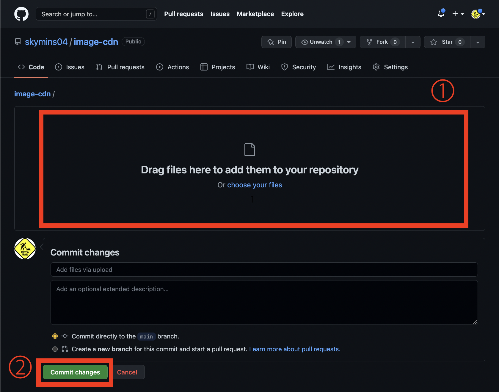
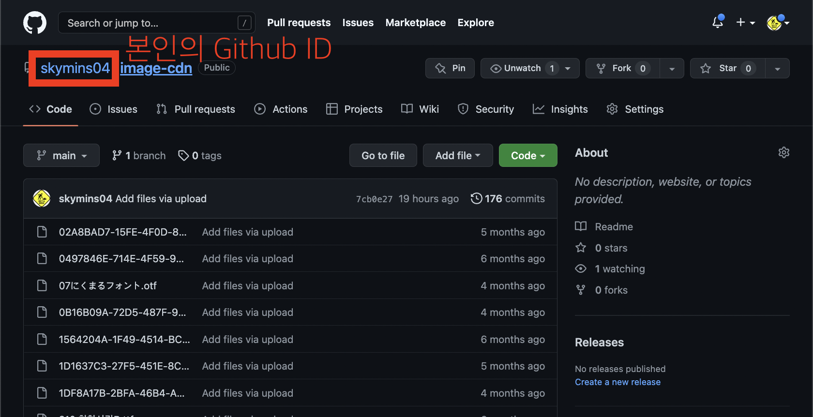
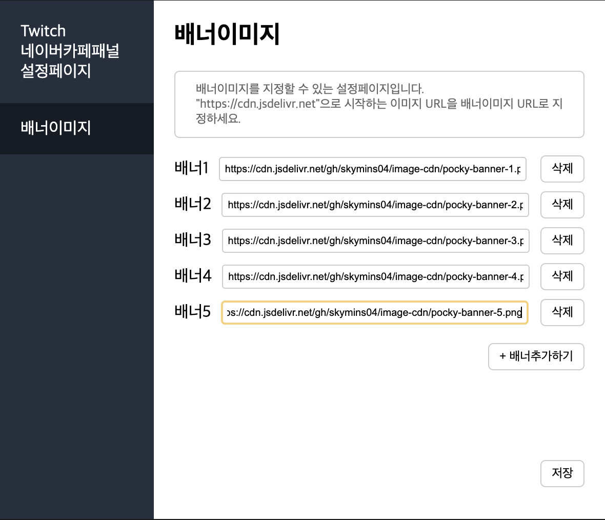

# CDN 서비스 사용방법 안내

```
"CDN 서비스"란,
이미지(png, jpg, gif 등), 동영상, 문서 등 여러종류의 파일에
URL을 통해 접근할 수 있도록 해주는 서비스입니다
```

네이버카페 트위치 패널의 하단배너에 이미지를 넣기 위해선 CDN 서비스를 이용해 이미지의 URL을 생성하고, 그 URL을 배너이미지로 등록해주는 과정이 필요합니다!

## 1. 저장소에 이미지 업로드 방법


image-cdn 저장소에 접속한 뒤 "Add sile -> Upload files"을 클릭합니다.


파일 업로드 페이지에 접속한 후,
① 영역에 파일을 "Drag & Drop"하거나 "choose your files"를 클릭하여 업로드한 파일을 선택합니다.  
업로드할 파일 선택이 완료되면 ②의 "Commit changes" 버튼을 클릭하여 파일을 업로드 합니다.

## 2. CDN URL 사용방법

CDN URL은 아래와 같은 규칙을 가지고 있습니다.

```
https://cdn.jsdelivr.net/gh/{본인의_Github_ID}/image-cdn/{파일명.확장자}
```

**{본인의\_Github_ID}** 부분과 **{파일명.확장자}** 부분에  
각각 **_본인의 Github ID_**와 **_CDN으로 접속할 파일의 이름_**(확장자까지 포함하여 작성)을 기입해주면 됩니다.

(참고) 본인의 Github ID는 왼쪽 상단에 있는 "image-cdn"이라는 문장 왼쪽에 있는 것입니다.



## 3. 배너이미지 등록방법

트위치 확장프로그램 관리자에 들어가서 "네이버카페 트위치 패널"의 톱니바퀴 버튼을 클릭해 패널설정페이지로 들어갑니다.



**"+배너추가하기" 버튼**을 누르면 새로운 배너를 생성할 수 있으며, 배너이미지주소를 **"2. CDN URL 사용방법"** 에서 설명한대로 배너로 등록할 이미지의 URL을 작성하여 입력창에 기입해주시면 됩니다 (URL 작성시 오타가 발생하면 이미지가 정상적으로 불러와지지 않으니 주의 부탁드립니다.)

배너수정이 완료되면 오른쪽 하단에 **"저장" 버튼**을 클릭하여 설정을 저장합니다.
